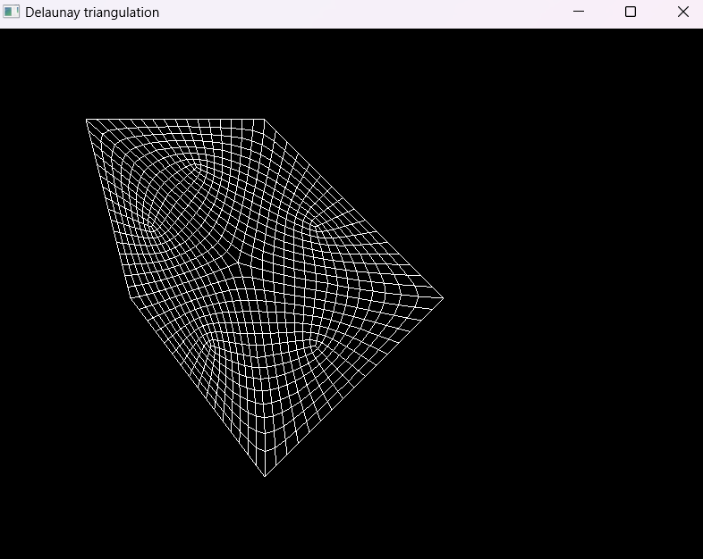

# Algos
Some common Numerical Analysis, Computational Geometry, Sorting and Searching algorithms.

Example Delaunay triangulation

Example Ruppert refinement

Example Lloyd smoothing

Example Laplace smoothing

Example Catmull-Clark quadrangulation

